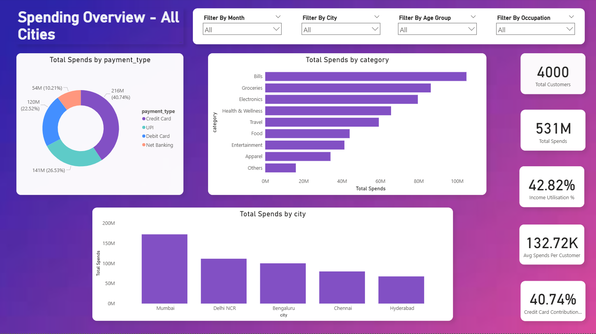
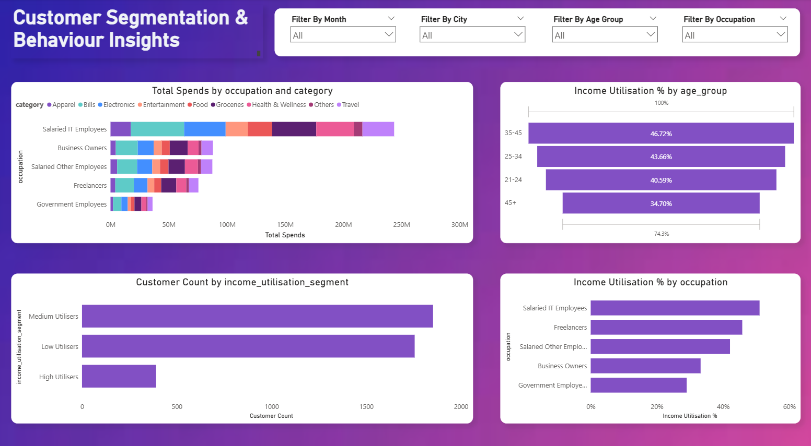
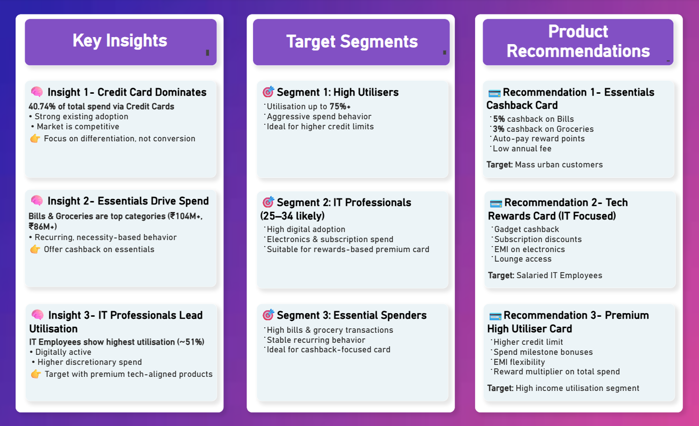

# 💳 Mitron Bank Credit Card Strategy Analysis

## 📌 Project Overview

This project analyzes customer spending behavior to support a bank’s product strategy team in launching a new credit card portfolio.

Using 6 months of transaction data from 4,000 customers across 5 cities, the objective was to identify high-value customer segments, spending patterns, and product feature opportunities.

The focus of this analysis was not just reporting, but generating actionable business insights aligned with strategic decision-making.

## 🎯 Business Problem

Mitron Bank planned to introduce a new line of credit cards but required data-driven insights before finalizing product features and target segments.

The product strategy team needed clarity on:

- Which customer segments generate the highest value?
- How aggressively do customers spend relative to their income?
- Which spending categories dominate recurring transactions?
- What type of credit card structure would align with observed behavior?

The objective of this analysis was to translate raw transaction data into actionable product strategy recommendations.

## 📊 Dataset Summary

The dataset provided included:

- 4,000 customers across 5 major cities  
- 6 months of transaction-level spending data  
- Monthly average income per customer  
- Customer demographics (age group, occupation, marital status, city)  
- Payment method used (Credit Card, Debit Card, UPI, Net Banking)

The data enabled behavioral spending analysis and segmentation across demographic groups.

## ⚠️ Data Limitations

While the dataset was rich in transaction behavior, it did not include:

- Credit scores  
- Repayment history  
- Credit limits  
- Default indicators  
- Customer lifetime value metrics  

As a result, recommendations were focused on spending behavior and utilisation patterns rather than credit risk modeling.

Future analysis could be strengthened by incorporating risk and repayment data to support more comprehensive product strategy decisions.

## 🧠 Analytical Approach & Modeling Decisions

### Time Alignment Adjustment

One key modeling challenge was aligning time frames.

Income data was recorded monthly, while transaction data covered a 6-month period.  
To ensure accurate income utilisation calculations, income values were normalized to match the transaction time frame before analysis.

This prevented inflated utilisation percentages and ensured consistency across metrics.

### Custom Metrics Developed

Instead of relying solely on raw totals, several analytical measures were created to enable deeper segmentation:

- **Income Utilisation %** — Measured customer spending relative to income over the analysis period  
- **Payment Contribution %** — Identified behavioral preference across payment modes  
- **Average Spend per Customer** — Assessed spending intensity across segments  
- **High / Medium / Low Utiliser Segmentation** — Enabled identification of high-value customer groups  

These measures shifted the analysis from descriptive reporting to strategic segmentation and decision-support insights.

## 🔎 Key Insights

- **Credit Cards account for 40.74% of total spend**, indicating strong existing adoption and a competitive market environment.

- **Bills (₹104M+) and Groceries (₹86M+) are the dominant spending categories**, highlighting recurring and necessity-driven transaction behavior.

- **Salaried IT Professionals demonstrate the highest income utilisation (~51%)**, suggesting strong engagement and digital adoption.

- High-utilisation customers reach **75%+ income utilisation levels**, indicating potential for premium product targeting.

The analysis revealed that the opportunity was not increasing basic adoption, but designing differentiated products aligned with behavioral segments.

## 💡 Strategic Recommendations

Based on observed behavioral patterns and segmentation insights, a three-tier credit card strategy was proposed:

### 1️⃣ Essentials Cashback Card
Target Segment: Recurring spenders across Bills and Groceries  

- Cashback on essential categories  
- Auto-pay reward incentives  
- Low annual fee to encourage mass adoption  

Designed to capture stable, recurring monthly transactions.

### 2️⃣ Tech Rewards Card
Target Segment: Salaried IT Professionals and digitally active customers  

- Gadget and electronics cashback  
- Subscription and digital service rewards  
- EMI flexibility on high-value purchases  

Aligned with digitally engaged, higher-utilisation customers.

### 3️⃣ Premium High-Utiliser Card
Target Segment: High income utilisation customers  

- Higher credit limits  
- Milestone-based reward multipliers  
- Enhanced lifestyle benefits  

Focused on maximizing wallet share from aggressive spenders.

## 📊 Dashboard Preview

### Executive Overview

### Customer Segmentation & Behaviour Insights

### Product Strategy & Recommendations

